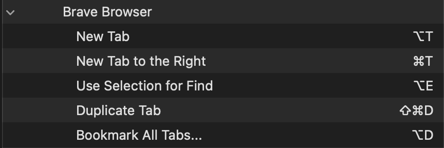

-   brave

    -   settings
        -   is default browser
        -   new tab page shows blank page
        -   show home button OFF
        -   show bookmarks button OFF
        -   show autocomplete
            -   browsing history
            -   bookmarks
        -   use wide address bar
        -   always full urls
        -   always show toolbar in fullscreen
        -   show sidebar never
        -   show tab search button
    -   extensions
        -   bitwarden
        -

-   settings

    -   accesibility

        -   use trackpad gesture to zoom
        -   spoke content speaking rate 4

    -   control center

        -   sound always show
        -   battery show percentage
        -   spotlight don't show in menu bar

    -   desktop and dock

        -   dock size 1/4
        -   ask to keep changes when closing documents
        -   automatically rearrange spaces based on most recent use OFF
        -   when switching to an application switch to a space with open windows for the application ON
        -   hot corners OFF
        -   shortcuts NONE

    -   displays
        -   more space
    -   wallpaper

        -   colors black

    -   keyboard

        -   text input -> edit...

            -   use caps lock to switch to and from abc ON
            -   spelling OFF
            -   capitalize OFF
            -   double space period OFF
            -   smart quotes off

        -   shortcuts
            -   input sources
                -   all OFF
            -   app shortcuts
                -   brave
                    
                -   asdf
            -   mission control
                -   mission control OFF
                -   quick note OFF

    -   trackpad
        -   tracking_speed[-3]
        -   more gestures
            -   app expose swipe down with three fingers

-   telegram

    -   theme https://t.me/addtheme/mtgold
    -   chat folders -> tabs at the top

-   amphetamine

    -   end session when forced to sleep
    -   allow system sleep when display is closed
    -   appearance molecule
    -   enable triggers -> schedule trigger -> 9:00—22:00
        -   allow display sleep + allow system sleep when display is closed

-   brew
    -   asdf

---

-   slack
-   rectangle
-   vscode
-   homebrew
    -   from https://brew.sh/

---

-   todo

    -   try control center -> menu bar only -> clock -> Announce the time
